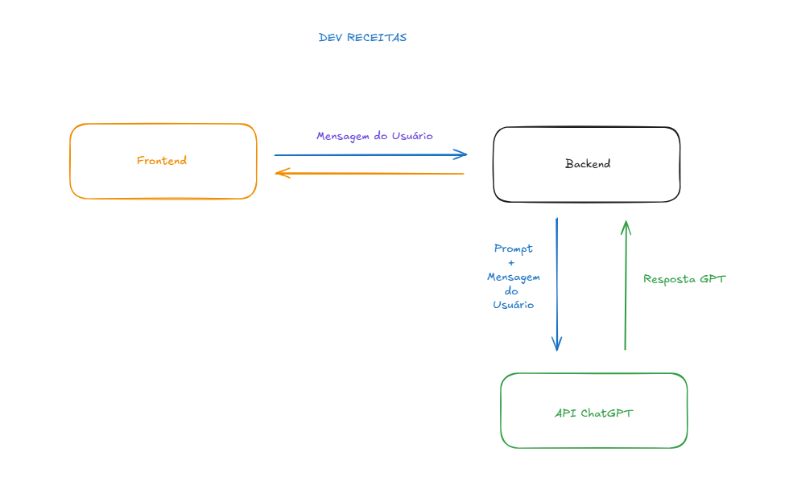
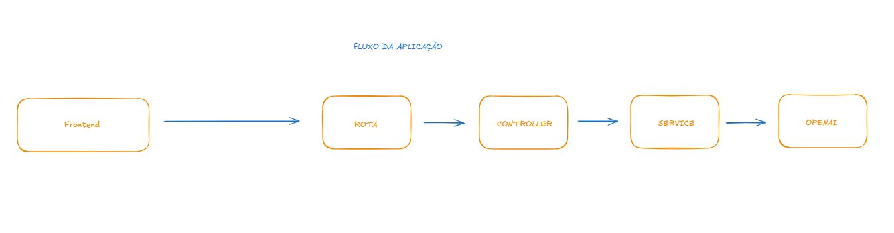

# 🍳 Dev Receitas – Chat Automatizado com IA

Aplicação que utiliza Inteligência Artificial para gerar receitas culinárias automaticamente a partir das perguntas enviadas pelo usuário.

O projeto é composto por duas partes:
- **Frontend:** React + Vite
- **Backend:** Node.js + Express
- **OpenAI API** para geração das respostas inteligentes.

## Fluxo da aplicação




---

## 🚀 Tecnologias Utilizadas

### **Frontend**
- React
- Vite
- Axios

### **Backend**
- Node.js
- Express
- OpenAI API
- Nodemon (para desenvolvimento)

---

## 📦 Como Rodar o Projeto

### 🔧 Pré-requisitos
Certifique-se de ter instalado:
- Node.js (18+)
- NPM ou Yarn
- Chave da API OpenAI

---

## 🟦 Backend (Node.js + Express)


### 1. Instalar dependências
```
cd api
npm install
```

### 2. Rodar o servidor
```
npm run dev
```

A API estará disponível em:
```
http://localhost:3000
```

---

## 🟩 Frontend (React + Vite)

### 1. Instalar dependências
```
cd frontend
npm install
```

### 2. Rodar o projeto
```
npm run dev
```

A aplicação estará acessível em:
```
http://localhost:5173
```

---

## 🔐 Variáveis de Ambiente

Crie um arquivo **.env** dentro da pasta do backend contendo:

```
OPENAI_KEY=your_openai_key_here
PORT=3000
```

⚠️ Importante: Nunca exponha a chave OPENAI_KEY no frontend!  
Ela deve ficar exclusivamente no backend.

---

## 📡 Funcionamento do Sistema

1. O usuário faz uma pergunta no frontend sobre uma receita.
2. O frontend envia a requisição para o backend.
3. O backend utiliza a API da OpenAI para gerar a resposta.
4. A resposta é retornada ao frontend.
5. O usuário visualiza a receita pronta na interface.

---

## 📁 Estrutura do Projeto

```
dev-receitas/
├── api/
│   ├── src/
│   │   ├── controllers/
│   │   ├── routes/
│   │   ├── services/
│   ├── server.js
│   ├── .env
│
└── frontend/
    ├── src/
    ├── index.html
    ├── vite.config.js
```

---

## 🧪 Possíveis Melhorias

- Criar histórico de receitas já geradas
- Sistema de login
- Banco de dados para armazenamento de consultas
- Prompts mais avançados
- Layout aprimorado e mais interativo

---

## 📝 Licença

Projeto criado para fins de estudo e uso pessoal.
